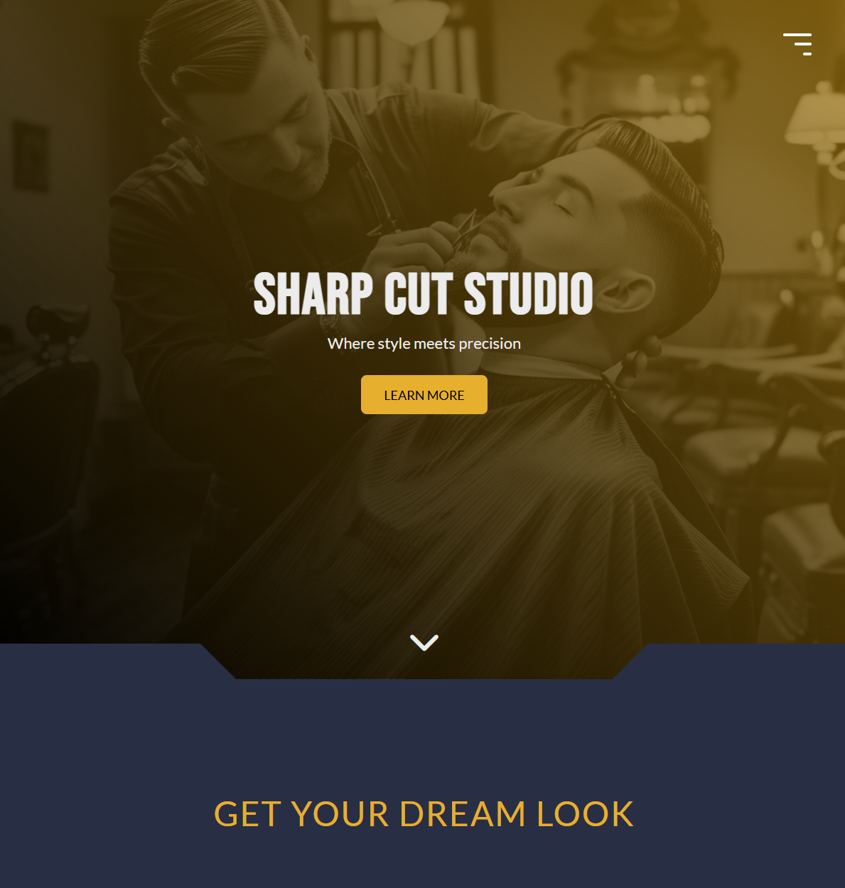

# Sharp Cut Studio — Landing Page ✂️

A small educational front-end project: a landing page for a barbershop built with semantic HTML, SCSS, vanilla JavaScript and a little bit of slick.js  
Focus: responsive layout, smooth UI interactions and practicing SCSS structure + JS DOM manipulation, BEM practice.



---

## 🔗 Live demo

https://flafii.github.io/sharp-cut-studio/

---

## 🛠 Tech Stack

- HTML5 (semantic)
- SCSS (modular partials, mixins)
- JavaScript (DOM, events)
- Slick Carousel (for reviews)
- Responsive Web Design (media queries, mobile-first)

---

## ✨ Features

- Responsive layout (mobile / tablet / desktop)
- Animated burger menu with open/close animation and **scroll lock** on mobile
- Nav items animation and dynamic current year in footer
- Smooth section spacing and image assets
- Simple carousel for reviews
- BEM classes naming

---

## 📂 Project structure (important files)

/ (root)
├─ index.html
├─ css/style.css
├─ css/style.css.map
├─ scss/style.scss
├─ scss/\_reset.scss
├─ scss/\_colors.scss
├─ scss/\_mixins.scss
├─ scss/\_components.scss
├─ js/main.js
├─ js/slick.js
├─ readme.md
└─ img/...

---

## ▶️ How to run locally

```bash
# clone
git clone https://github.com/FlaFii/sharp-cut-studio.git

# open
cd sharp-cut-studio
# open index.html in browser (or use live server extension)
```

## 💡 What I learned

Structuring SCSS with partials and @use

Handling mobile navigation UX (toggle, close on link, scroll lock)

Working with third-party slider (Slick) and responsive breakpoints

Debugging JS event listeners and DOM flow

Naming classes with BEM

Splitting code into smaller files to keep code nice and tidy

## 👤 Author

FlaFii • https://github.com/FlaFii

Contact: mateusz.szymus7@gmail.com
